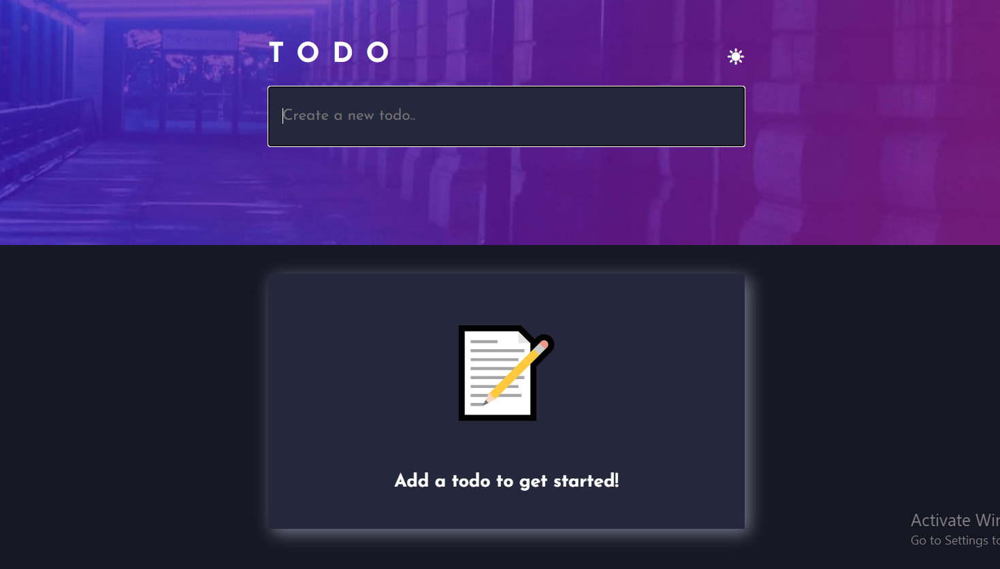
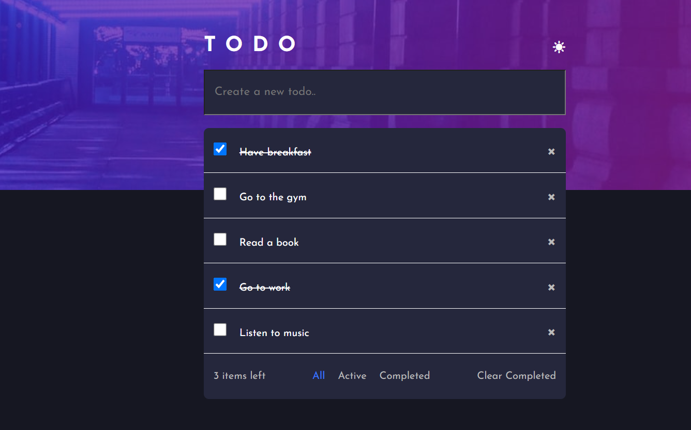

# React Todo App

This is a simple Todo App built using React.js. It allows users to manage their tasks efficiently.

## Functionality

The Todo App provides the following features:

1. **Create a Todo:**
   - Users can add new tasks to the list by entering a description and clicking the "Add" button.

2. **View a List of All Tasks:**
   - The app displays a list of all the tasks with their completion status.

3. **Mark Tasks as Completed:**
   - Users can mark a task as completed by clicking a checkbox next to the task description.

4. **Filter Tasks by Completion Status:**
   - There are options to filter tasks by All, Completed, or Active (not completed).

5. **Delete Tasks:**
   - Users can delete a task by clicking a delete button next to the task.

### Links
- Live Site URL: [Live site URL](https://todoapp-reactjs-app.netlify.app)

## Screenshots

## Technologies Used
- React.js: A JavaScript library for building user interfaces.

- JavaScript: The programming language used for the app's logic.
- CSS: Styling for the user interface.

- HTML: The structure of the web page.

## Author

- Frontend Mentor - [@Ibrahimali2020](https://www.frontendmentor.io/profile/Ibrahimali2020)
- Twitter - [@Ibrahim2016egy](https://www.twitter.com/Ibrahim2016egy)

